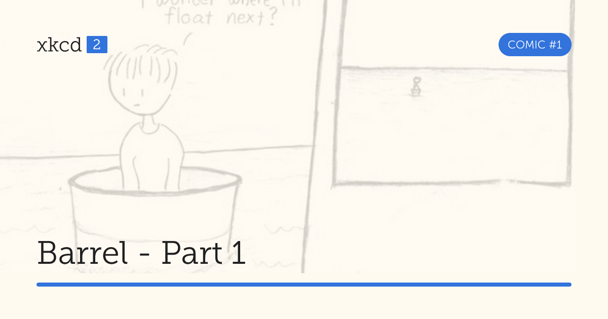

# Nitro starter

Look at the [nitro quick start](https://nitro.unjs.io/guide#quick-start) to learn more how to get started.

## Open Graph images

Comic pages use absolute URLs for their Open Graph and Twitter images. Images are
generated at `/og/<comic-id>.png` with a size of 1200 x 630 pixels.

Images use the site's Adobe Fonts kit: Museo Slab for the logo and comic title,
and Museo Sans for the comic number. Font files are fetched on the
first image request and reused for later requests in the same server process.
The server needs access to `use.typekit.net` to load them.

The logo badge, comic-number pill, and accent bar use the site's blue. The comic
number is white on blue.
Each image uses a zoomed crop of its comic as a faint background. The 64-pixel
title is aligned left, just above the blue accent bar, with no caption.
The server also needs access to the comic image host.

Example for [comic #1](https://xkcd.com/1/), with the `xkcd2` text logo:

The comic title and artwork are by Randall Munroe, used under
[CC BY-NC 2.5](https://creativecommons.org/licenses/by-nc/2.5/).

Run `pnpm test` to check the page metadata and image responses against a Vercel
production build. The tests use an in-memory comic cache and do not need Vercel KV
credentials or access to the xkcd API. Adobe Fonts and comic artwork requests use
local fixtures.

## Comic reader

The reader keeps xkcd's hover text visible below each comic. Artwork uses the
comic's transcript as its text alternative when one is available. If a transcript
is missing, the text alternative identifies the comic and states that no
transcript is available. The image link opens the full-size artwork.

Previous and Next stop at the archive boundaries and skip comic 404, which xkcd
does not publish. Random includes the first and latest comics and excludes 404.
Missing comics return an HTML recovery page with HTTP status 404. Upstream
failures keep their error status and provide a retry action. JSON API errors
remain JSON.

Reader-specific styles are in `src/public/css/reader.css`, loaded after the
existing Bulma stylesheet. Edit this file for title scaling, keyboard focus, and
touch targets rather than editing the generated CSS bundles.
